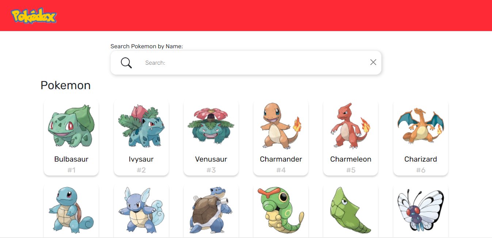
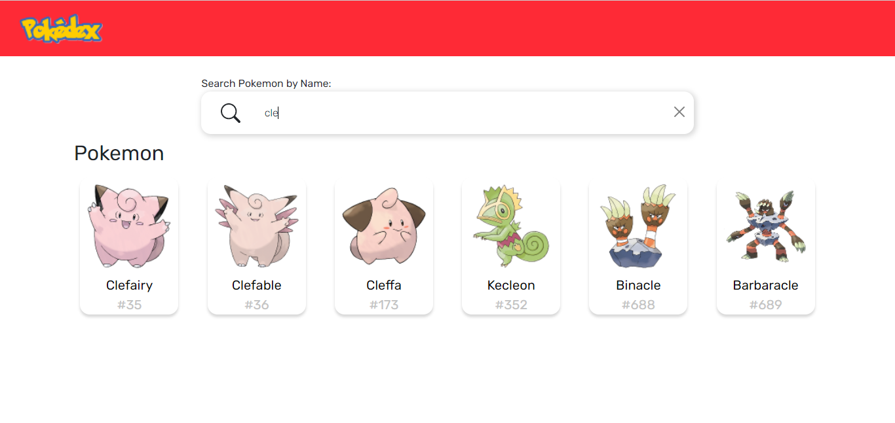
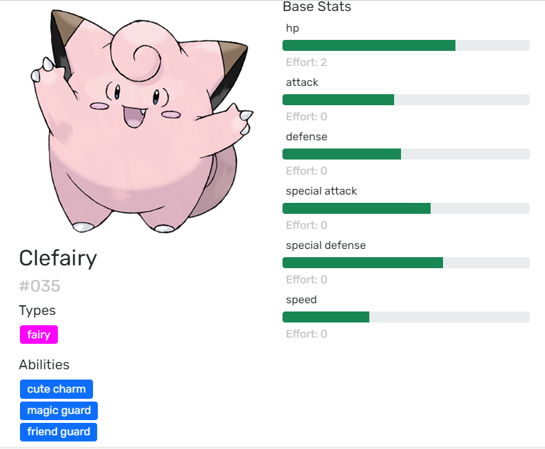

# Pokedex React App

A virtual Pokedex that allows users to search through 1000+ Pokemon and view information about their stats and abilities.

## Try it out
Link: https://pokedex-7e070f.netlify.app/

## Inspiration
- PokeAPI
https://pokeapi.co/

## Built With
- React
- PokeAPI

## Demo
### Homepage

### Search Feature

### Pokemon Info

## What I learned
- Serving and Sorting Data From an API
- Automatic Filtering of Search Results
- Managing and passing down state
- Redux
